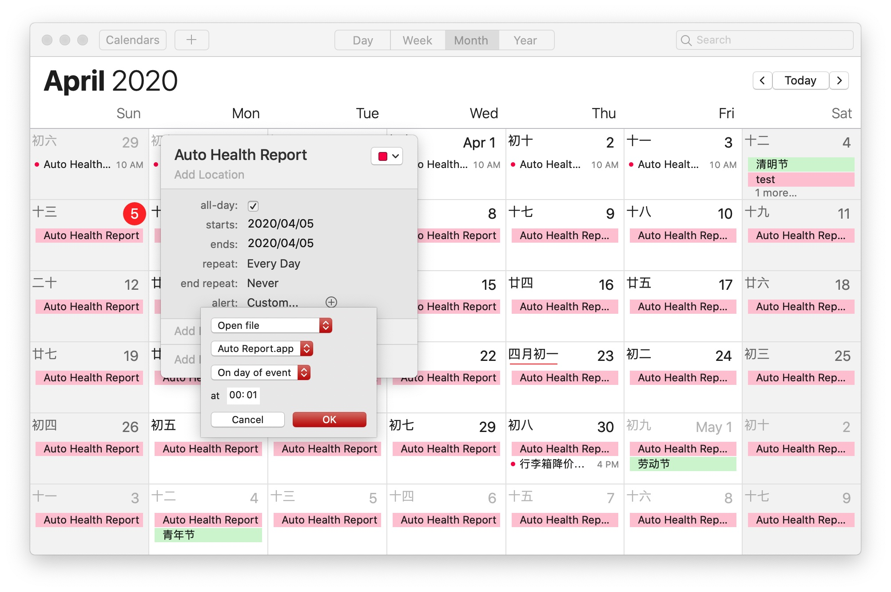
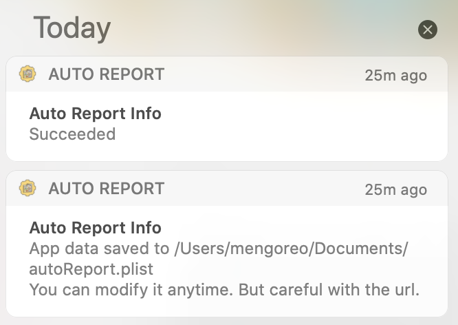

转为我浙学子准备的自动健康打卡应用，目前该应用只支持 Mac 平台，已在 Catalina 上测试通过，暂时没有使用低版本测试。

可结合日历实现自动打卡，如图所示：

建议将事件设为「全天」，这样在你电脑锁屏的时候，如果错过了设置的打卡时间，打开电脑之后会继续未完成的任务，保证定时的有效性。

> 使用上次未公开版本的同学，可以直接覆盖。但是依旧需要手动打开一次，保证权限的正常。

打卡成功、失败之后，新增提示消息。点击消息重新打卡（若未成功）。

欢迎 PR🧏🏻

> 请小心使用，被老师批评，本人概不负责。🧏🏻